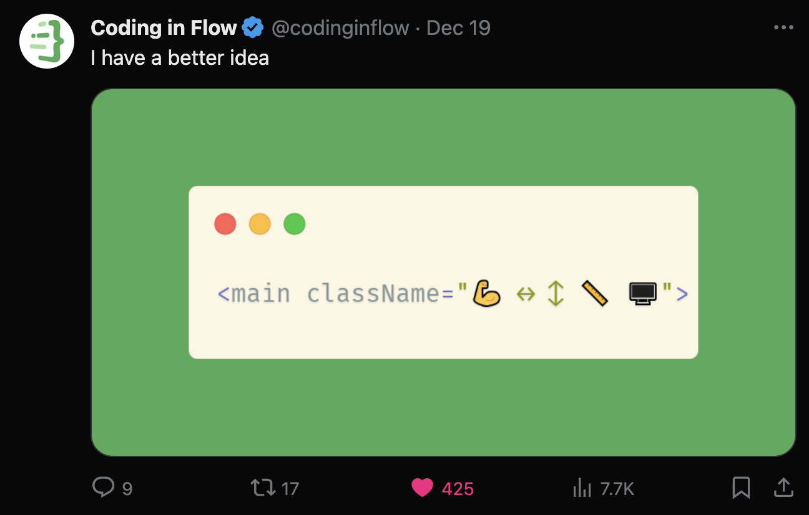

`We've worked hard on this project over the past 45 minutes, and it's safe to say we're version 1.x ready (let's ship to prod baby!)`

## Credits

Original idea was from Coding in Flow

- https://www.youtube.com/c/codinginflow
- https://twitter.com/codinginflow



# hyroglyphicss

Style your html using emojis

- 💪 flex
- 🍆 flex-grow
- ⭕️ rounded-full
- 🙈 hidden
- and more...

## But why?

Tailwind classes often become too large and go off my monitor, but luckily emojis are plentiful and can be used for classes.

Buckle up boys, we've reached peak web development.

## How to Use

Install it

`npm i hyroglyphicss`

import it (yes, like in your `global.css` file you chad).

```
// global.css

@import hyroglyphicss
```

Start using the emojis in your html

- 💪 flex
- ↔️ flex items-center
- ↕️ flex flex-col justify-center
- 🙏 justify-center
- 🍆 flex-grow
- ✋ gap-4
- 🖐️ gap-8
- 🖖 gap-12
- 🎯 items-center
- ⬜️ bg-gray-50
- ⬛️ bg-gray-900
- ⭕️ rounded-full
- 🙈 hidden
- ❶ p-2
- ❷ p-4
- ❸ p-8
- ␣ justify-between
- 🔳 text-gray-900
- ⑴ text-sm
- ⑵ text-lg
- ⑶ text-xl
- ⑷ text-2xl
- ↕️ flex-col
- 🫙 container
- ▢ rounded
- 🥉 grid grid-cols-3
- 👈 self-start
- 👉 self-end
- 👆 self-start
- 👇 justify-self-end
- 🍑 w-full
- ◻️ text-gray-50

## How to Contribute

Don't

This was a joke
